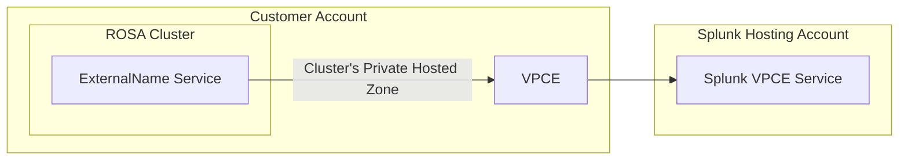

# aws-vpce-operator (AVO)

AVO is an OpenShift operator that manages connectivity to private VPC Endpoint Services via VPC Endpoints and aims to make private network connectivity easy and painless.

[](https://codecov.io/gh/openshift/aws-vpce-operator)

## Usage

In a practical sense, given a service that is exposed via an AWS VPC Endpoint Service (i.e. not exposed over the public internet), the [VpcEndpoint CRD](./deploy/crds/avo.openshift.io_vpcendpoints.yaml) defines an API to configure three components in a customer cluster to create network connectivity between components in a customer cluster and the private VPC Endpoint Service, illustrated below.



If auto-acceptance is disabled on the VPC Endpoint Service, then the VPC Endpoint will be in a `pendingAcceptance` state until the connection is accepted inside the service hosting account. Work is being done to provide an automated solution for this acceptance!

### Requirements

AVO currently assumes it is running on an AWS OpenShift cluster, specifically:

* The existence of a `infrastructures.config.openshift.io` CR named `default`
* The existence of a `dnses.config.openshift.io` CR named `default`
* Minimum K8s RBAC defined [here](./deploy/15_clusterrole.yaml)
* Minimum AWS IAM Policy:

```json
    {
      "Version": "2012-10-17",
      "Statement": [
        {
          "Effect": "Allow",
          "Action": [
            "ec2:CreateTags",
            "ec2:DeleteTags",
            "ec2:DescribeTags",
            "ec2:DescribeSubnets",
            "ec2:CreateSecurityGroup",
            "ec2:DeleteSecurityGroup",
            "ec2:DescribeSecurityGroups",
            "ec2:AuthorizeSecurityGroupIngress",
            "ec2:AuthorizeSecurityGroupEgress",
            "ec2:DescribeSecurityGroupRules",
            "ec2:DescribeVpcs",
            "ec2:CreateVpcEndpoint",
            "ec2:DeleteVpcEndpoints",
            "ec2:DescribeVpcEndpoints",
            "ec2:ModifyVpcEndpoint",
            "route53:ChangeResourceRecordSets",
            "route53:ListHostedZonesByName",
            "route53:ListResourceRecordSets",
            "route53:ListTagsForResource",
            "route53:GetHostedZone",
            "route53:CreateHostedZone",
            "route53:ChangeTagsForResource"
          ],
          "Resource": "*"
        }
      ]
    }
```

## Custom Resource Definitions (CRDs)

## VpcEndpoint

```yaml
---
apiVersion: avo.openshift.io/v1alpha1
kind: VpcEndpoint
metadata:
  name: "demo"
spec:
  externalNameService:
    name: "exampleservice"
    namespace: "examplenamespace"
  securityGroup:
    ingressRules:
      - fromPort: 9997
        toPort: 9997
        protocol: "tcp"
  serviceName: "com.amazonaws.vpce.us-east-1.vpce-svc-00000000000000000"
  subdomainName: "examplesubdomain"
  addtlHostedZoneName: "supplemental.routing.tld" #Optional
```

* `.spec.serviceName` is the name of the VPC Endpoint Service to connect to
* `.metadata.name` becomes the name of the VPC Endpoint
* `.spec.subdomainName` generates a Route53 CNAME record in the cluster's Private Hosted Zone in the form of `${subdomainName}.${clusterBaseDomain}` pointing to the VPC Endpoint Regional DNS Name.
* `.spec.externalNameService` defines the name and namespace the ExternalName service that will be created pointing to the Route53 record created above.
* `.spec.securityGroup` defines security group ingress and egress rules that will be attached to the created VPC Endpoint
* `.spec.addtlHostedZoneName` is an optional fully qualified domain name used for supplemental Private Hosted Zone(s) to accommodate records outside of the `${clusterBaseDomain}`

## VpcEndpointAcceptance

```yaml
---
apiVersion: avo.openshift.io/v1alpha1
kind: VpcEndpointAcceptance
metadata:
  name: example-acceptance
  namespace: example-namespace
spec:
  id: "vpce-svc-123456789"
  assumeRoleArn: "arn:aws-us-gov:iam::123456789:role/exampleIAMrole"
  region: "us-gov-west-1"
  acceptanceCriteria:
    awsAccountOperatorAccount:
      namespace: aws-account-operator
```

* `.spec.id` is the Service ID of the VPC Endpoint Service to connect to
* `.spec.assumeRoleArn` is the IAM role in the account of the Endpoint Service that grants permission to handle acceptance
* `.spec.region` is the AWS region where the Endpoint Service resides

## FedRAMP Cluster Deployments

AVO is currently deployed to all FedRAMP clusters through App Interface using the template in this repo and OLM. To ensure clusters are automatically configured for Splunk log forwarding, a VPC Endpoint is created on all clusters using [Managed Cluster Config](https://github.com/openshift/managed-cluster-config/tree/master/deploy/osd-avo-resources/fedramp-vpc-endpoints).

Tangentially, AVO has a Namespace file in the FedRAMP App Interface to manage other crucial configurations:

* A ConfigMap with an AvoConfig object to enable the acceptance controller on Hives
* Two VpcEndpointAcceptance objects to handle auto-acceptance for our Splunk VPC Endpoint Service in either Gov Region

## Development

Looking to work on this? See [dev/README.md](./dev/README.md)
