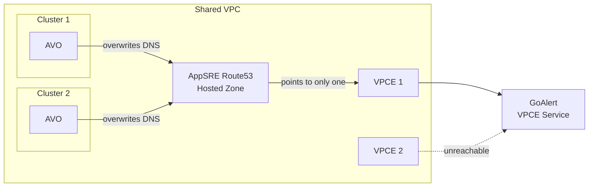
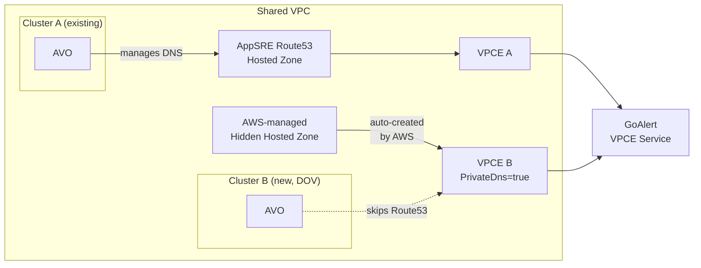
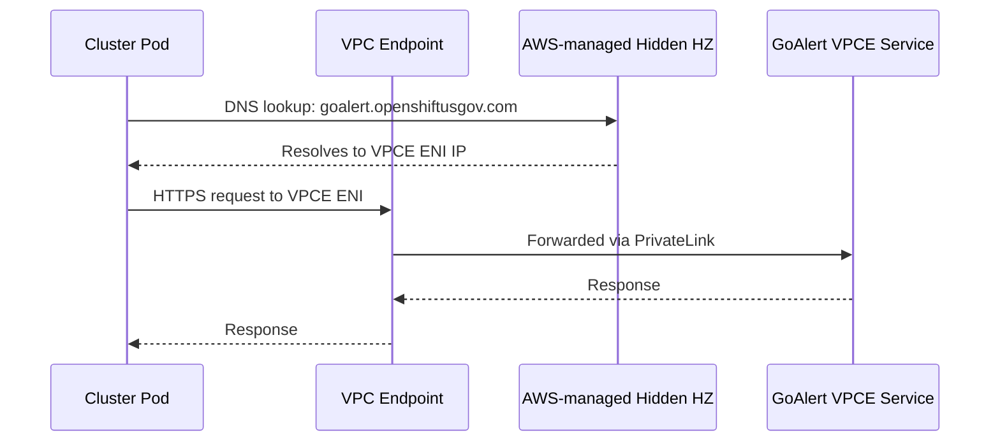

# Implement enablePrivateDns for Multi-Cluster VPC Support

Last Updated: 02/12/2026

## Summary

Implements the `enablePrivateDns` field on the `VpcEndpoint` CR. When enabled, DNS resolution for a VPC Endpoint
is handled at the VPC Endpoint Service level via AWS
[Domain Ownership Verification](https://docs.aws.amazon.com/vpc/latest/privatelink/manage-dns-names.html#verify-domain-ownership)
(DOV), instead of through Route53 hosted zone records managed by AVO.

This is gated behind an operator-level feature flag (`enablePrivateDns`) in the `AvoConfig` ConfigMap, defaulting
to `false`.

### Current State

Each cluster's AVO instance manages Route53 DNS records in a shared hosted zone. When multiple clusters exist in
the same VPC (e.g. FedRAMP BYOVPC), each cluster's AVO overwrites the DNS entry for endpoints with a static
address like GoAlert. One cluster "wins" and the other loses connectivity, causing failed heartbeats. Deleting one
cluster also removes the DNS entry, breaking the remaining cluster.



## Motivation

This change is important because:

- Multiple clusters in a single VPC cannot reliably reach endpoints with static DNS names (e.g. GoAlert) due to
  Route53 record conflicts
- Deleting one cluster in a shared VPC breaks DNS resolution for the other
- Commercial ROSA already supports multi-cluster BYOVPC; this brings feature parity to FedRAMP

## Relevant Stories

- [SREP-3552](https://issues.redhat.com/browse/SREP-3552) AVO overwrites DNS entries for goalert when 2 clusters are deployed to same VPC
- [OSD-18595](https://issues.redhat.com/browse/OSD-18595) (previously reported related bug)
- [OSD-24654](https://issues.redhat.com/browse/OSD-24654) (DDR ticket)

## Goals

- Two or more clusters in a single VPC can each independently reach a VPC Endpoint Service endpoint (e.g. GoAlert)
- Deleting one cluster does not affect VPC Endpoint connectivity for other clusters in the same VPC
- Existing clusters using Route53-based DNS resolution are unaffected
- The feature is gated behind an operator-level feature flag for safe rollout

## Non-Goals/Future Work

- Performing Domain Ownership Verification itself (this is an out-of-band AppSRE operation on the VPCE Service)
- Modifying existing VPC Endpoints to toggle `PrivateDnsEnabled` (only applies at creation time)
- Migrating existing clusters from Route53-based DNS to DOV-based DNS

## Proposal

### Operator-Level Feature Flag

A new `enablePrivateDns` field in `AvoConfig` (`api/v1alpha1/avoconfig_types.go`) gates the feature. It defaults
to `false` and is set via the `avo-config` ConfigMap:

```yaml
apiVersion: v1
kind: ConfigMap
metadata:
  name: avo-config
  namespace: openshift-aws-vpce-operator
data:
  avo_config.yaml: |-
    apiVersion: avo.openshift.io/v1alpha1
    kind: AvoConfig
    enableVpcEndpointController: true
    enablePrivateDns: true
```

Both the operator-level flag AND the per-CR `spec.enablePrivateDns` field must be `true` for the feature to
activate. This allows a staged rollout: enable the flag at the operator level, then only new VpcEndpoint CRs
that set `enablePrivateDns: true` will use DOV.

### Reconciliation Changes

When `enablePrivateDns` is active for a VpcEndpoint:

1. **VPC Endpoint creation** -- `PrivateDnsEnabled: true` is passed to the AWS `CreateVpcEndpoint` API. AWS then
   creates a hidden, cluster-specific hosted zone that routes the service's private DNS name to this specific
   VPC Endpoint.

2. **DNS validation skipped** -- `validateCustomDns()` returns early, skipping Route53 hosted zone management,
   record creation, VPC association authorization, and ExternalName service creation. A status condition
   (`AWSRoute53RecordReady`) is set with reason `PrivateDnsEnabled`.

3. **Cleanup skipped** -- `cleanupAwsResources()` skips Route53 record and hosted zone deletion. The
   AWS-managed hidden hosted zone is automatically cleaned up when the VPC Endpoint is deleted.

### Compatibility

Existing clusters continue using Route53-based DNS (`enablePrivateDns: false` by default). The two methods
coexist within the same VPC -- existing clusters resolve via the AppSRE hosted zone while new clusters resolve
via DOV-managed hidden hosted zones.



### User Story: GoAlert with DOV

```yaml
apiVersion: avo.openshift.io/v1alpha2
kind: VpcEndpoint
metadata:
  name: goalert
  namespace: openshift-aws-vpce-operator
spec:
  enablePrivateDns: true
  serviceName: "com.amazonaws.vpce.us-gov-west-1.vpce-svc-00000000000000000"
  securityGroup:
    ingressRules:
      - fromPort: 443
        toPort: 443
        protocol: "tcp"
  vpc:
    autoDiscoverSubnets: true
```

No `customDns` block is needed since DNS resolution is handled entirely by AWS.

### New Method: DNS Resolution Flow



## Risks and Mitigations

| Risk | Mitigation |
|------|------------|
| DOV not yet performed on the domain | Feature flag defaults to off; DOV must be completed as a prerequisite before enabling |
| Toggling enablePrivateDns on existing CRs | Only takes effect at VPC Endpoint creation time; existing VPCEs are not modified |
| Feature flag accidentally enabled without DOV | VPC Endpoint creation will succeed but private DNS resolution will not work until DOV is completed on the VPCE Service side |

## Alternatives

- **Shared security group approach** -- Have all clusters in a VPC share a single security group and VPCE.
  Rejected because it requires complex tag redesign, creates edge cases during install/uninstall, and breaks the
  1:1 mapping between VpcEndpoint CRs and AWS VPC Endpoints.

## References

- [SD-DDR-0040](https://docs.google.com/document/d/1VOOyn0RhXv_lDYCgku7CcRoaTkv7ynCnqTp4-F_Qg3Q/edit) -- Enabling Domain Ownership Verification for GoAlert's domain in FedRAMP
- [AWS Domain Ownership Verification docs](https://docs.aws.amazon.com/vpc/latest/privatelink/manage-dns-names.html#verify-domain-ownership)
