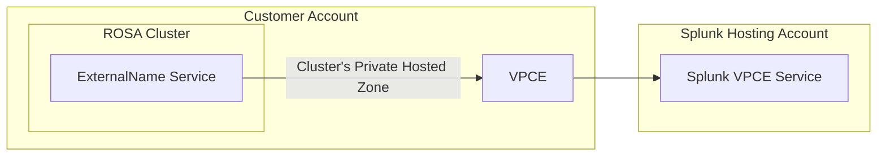
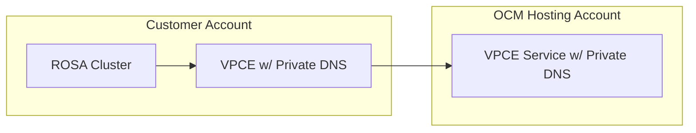
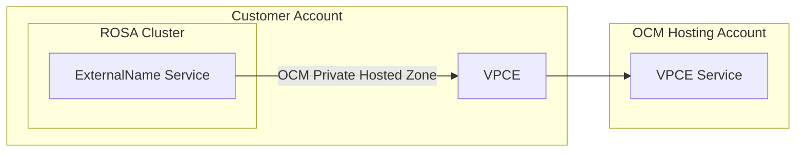
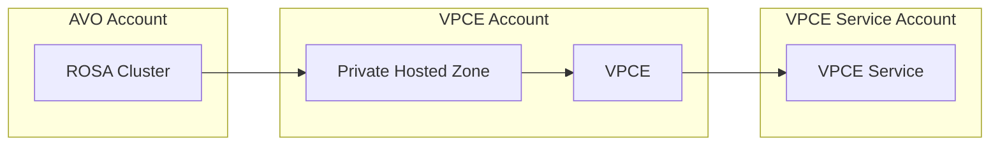

# Improve Flexibility of the AVO VpcEndpoint API

Author: @mjlshen

Last Updated: 11/16/2022

## Summary

`aws-vpce-operator` (AVO)'s `VpcEndpoint` CustomResource (CR) has worked reasonably well as an MVP to meet the initial
requirements in the FedRAMP project. However, as the amount of planned use cases continue to grow as well as new ones
within HyperShift, these slight differences are exposing how brittle the current API is and how difficult it is for
multiple development efforts to happen simultaneously without introducing breaking changes. The goal for the
`VpcEndpoint` CR should be to expose a core API that allows consumers to create an AWS VPC Endpoint which connects to a
VPC Endpoint Service and offer additional, optional, components that only some consumers need. A stable core with more
flexible additional components will help the `VpcEndpoint` CR continue to meet its needs and grow to meet future needs.

### Existing API

The existing API requires all fields and must always create a CNAME record in the ROSA cluster's Route 53 Private Hosted
Zone as well as an [ExternalName](https://kubernetes.io/docs/concepts/services-networking/service/#externalname) service.

```go
type VpcEndpointSpec struct {
	// ServiceName is the name of the VPC Endpoint Service to connect to
	ServiceName string `json:"serviceName"`

	// SecurityGroup contains the configuration of the security group attached to the VPC Endpoint
	SecurityGroup SecurityGroup `json:"securityGroup"`

	// SubdomainName is the name of the Route53 Hosted Zone CNAME rule to create in the cluster's
	// Private Route53 Hosted Zone
	SubdomainName string `json:"subdomainName"`

	// ExternalNameService configures the name of the created Kubernetes ExternalName Service
	ExternalNameService ExternalNameServiceSpec `json:"externalNameService"`
}
```
## Motivation

This change is important because:

- It will make currently required components that are not needed or relevant to all consumers optional
- It will align the design of this API based on our new understanding of the requirements for AVO
- It will allow future development efforts to proceed without requiring huge code refactors

## Relevant Stories

- [OSD-13509](https://issues.redhat.com/browse/OSD-13509) Optionally create an additional Private Hosted Zone
- [OSD-13910](https://issues.redhat.com/browse/OSD-13910) Make all unneeded resources optional
- [OSD-13916](https://issues.redhat.com/browse/OSD-13916) Remove the requirement of the `kubernetes.io/cluster/internal-elb` tag

## Goals

- Continue to support the existing use-case of inferring the VPC ID and Route 53 Private Hosted Zone of the PrivateLink ROSA cluster that contains the `VpcEndpoint` CR
- Commit to and provide a stable API to reconcile a single AWS Interface VPC Endpoint with a stable API
  - A required `.spec.serviceName` for the target VPC Endpoint Service
  - A required `.spec.securityGroup` for the Security Group/Security Group Rules attached to the VPC Endpoint
  - A required `.spec.vpc` for the VPC to create the VPC Endpoint in
- Provide an optional `.spec.customDns` to hold and configure the growth and expansion of custom DNS configurations around the VPC Endpoint
- Allow for the ability to create AWS resources in different AWS accounts
- Release a `v1alpha2` version

## Non-Goals/Future Work

- Implement support for all the possible new configurations (e.g. creating a new Route 53 Private Hosted Zone), those
will be handled in their own stories as needed. The priority will be to define the new API first and support
existing configurations
- Implement support for all other optional VPC Endpoint features that are currently unused, such as VPC Endpoint
Policies. With the current design these can be added in the future as needed.

## Proposal

The "core" `VpcEndpoint` CR specification that _should_ be able to remain free of breaking changes. `ServiceName`, `SecurityGroup`, and `Vpc` are always required when creating an AWS Interface VPC Endpoint.
Other optional configurations for AWS VPC Endpoints, such as VPC Endpoint policies, could be added in the future as defaulted or optional fields.

- `AssumeRoleArn` will allow AVO to use `sts:AssumeRole` to create VPC Endpoints in accounts other than where it is
running. This is identical to a field in the `VpcEndpointAcceptance` API and will be used for the same purpose.
- `CustomDns` will define configurations for all other custom DNS setups, such as a separate Route 53 Private Hosted
Zone or an `ExternalName` Kubernetes service.

```go
type VpcEndpointSpec struct {
	// AssumeRoleArn will allow AVO to use sts:AssumeRole to create VPC Endpoints in separate AWS Accounts
	AssumeRoleArn string `json:"assumeRoleArn,omitempty"`

	// Region will allow AVO to create VPC Endpoints and other AWS infrastructure in a specific region
	// Defaults to the same region as the cluster AVO is running on
	Region string `json:"region,omitempty"`

	// +kubebuilder:default=false
	// EnablePrivateDns will allow AVO to create VPC Endpoints with private DNS names specified by a VPC Endpoint Service
	// https://docs.aws.amazon.com/vpc/latest/privatelink/manage-dns-names.html (defaults to false)
	EnablePrivateDns bool `json:"enablePrivateDns"`

	// Unchanged
	// ServiceName is the name of the VPC Endpoint Service to connect to
	ServiceName string `json:"serviceName"`

	// Unchanged
	// SecurityGroup contains the configuration of the security group attached to the VPC Endpoint
	SecurityGroup SecurityGroup `json:"securityGroup"`

	// Vpc will allow AVO to use a specific VPC or use the same VPC as the ROSA cluster it's running on
	Vpc Vpc `json:"vpc"`

	// CustomDns will define configurations for all other custom DNS setups, such as a separate Route 53 Private Hosted
	// Zone or an `ExternalName` Kubernetes service.
	CustomDns CustomDns `json:"customDns,omitempty"`
}
```

### SecurityGroup

This is unchanged from the current API.

### VPC

By introducing a VPC struct, we now have the ability to specify a custom list of `SubnetIds` or continue to use the
current implicit behavior by setting `AutoDiscoverSubnets` to true or keeping the default value. In either case, the
VPC ID is still inferred from the provided subnets.

```go
type Vpc struct {
	// +kubebuilder:default=true
	AutoDiscoverSubnets bool     `json:"autoDiscoverSubnets"`
	SubnetIds           []string `json:"subnetIds,omitempty"`
}
```

### CustomDns

This is the biggest part of the refactor. Currently, the only known custom DNS configuration hinges on a
`Route53PrivateHostedZone`. If more arise in the future, they can be added as siblings in `CustomDns`.

- Like `Vpc`, `Route53PrivateHostedZone` has a boolean field `useRosaPrivateHostedZone` to maintain its existing behavior.
- `DomainName` provides a way for consumers to specify the domain name of a new Route 53 Private Hosted Zone.
- `Id` provides a way for consumers to specify the ID of an existing Route 53 Private Hosted Zone
- `Record` allows for customization of the Hosted Zone Record contained in the Route 53 Private Hosted Zone
  - `.spec.customDns.route53PrivateHostedZone.record.hostname` replaces `.spec.subdomainName` to use the same naming scheme that AWS uses.
  - `.spec.customDns.route53PrivateHostedZone.record.externalNameService` replaces `.spec.externalNameService` as an ExternalName service is only utilized as a convenience layer for interacting with the Route 53 Private Hosted Zone Record.

```go
type CustomDns struct {
	Route53PrivateHostedZone Route53PrivateHostedZone `json:"route53PrivateHostedZone,omitempty"`
}

type Route53PrivateHostedZone struct {
	// +kubebuilder:default=true
	AutoDiscover bool                    `json:"autoDiscoverPrivateHostedZone"`
	DomainName   string                  `json:"domainName,omitempty"`
	Id           string                  `json:"id,omitempty""`
	Record       Route53HostedZoneRecord `json:"record,omitempty"`
}

type Route53HostedZoneRecord struct {
	Hostname            string              `json:"hostname"`
	ExternalNameService ExternalNameService `json:"externalNameService,omitempty"`
}
```

## User Stories

### Existing FedRAMP Splunk Use-Case

Creating a VPC Endpoint in the same account and VPC as the cluster, with a custom DNS configuration of using an `ExternalName`
service and the cluster's existing Route 53 Private Hosted Zone.

```yaml
apiVersion: avo.openshift.io/v1alpha2
kind: VpcEndpoint
metadata:
  name: demo
  namespace: demo
spec:
  serviceName: "com.amazonaws.vpce.us-east-1.vpce-svc-00000000000000000"
  securityGroup:
    ingressRules:
      - fromPort: 9997
        toPort: 9997
        protocol: "tcp"
  vpc:
    autoDiscoverSubnets: true
  customDns:
    route53PrivateHostedZone:
      record:
        hostname: "splunk"
        externalNameService:
          name: "examplesvcname"
```



### Planned FedRAMP OCM Use-Case

Creating a VPC Endpoint in the same account and VPC as the cluster. VPC Endpoint resolution via private DNS configured
by the VPC Endpoint Service and no custom DNS configuration.

```yaml
apiVersion: avo.openshift.io/v1alpha2
kind: VpcEndpoint
metadata:
  name: demo
  namespace: demo
spec:
  enablePrivateDns: true
  serviceName: "com.amazonaws.vpce.us-east-1.vpce-svc-00000000000000000"
  securityGroup:
    ingressRules:
      - fromPort: 443
        toPort: 443
        protocol: "tcp"
  vpc:
    autoDiscoverSubnets: true
```



Creating a VPC Endpoint in the same account and VPC as the cluster. Custom DNS resolution via a separate Route 53
Private Hosted Zone created by AVO.

```yaml
apiVersion: avo.openshift.io/v1alpha2
kind: VpcEndpoint
metadata:
  name: demo
  namespace: demo
spec:
  serviceName: "com.amazonaws.vpce.us-east-1.vpce-svc-00000000000000000"
  securityGroup:
    ingressRules:
      - fromPort: 443
        toPort: 443
        protocol: "tcp"
  vpc:
    autoDiscoverSubnets: true
  customDns:
    route53PrivateHostedZone:
      autoDiscoverPrivateHostedZone: false
      domainName: "redhat.com"
      record:
        hostname: "ocm"
        externalNameService:
          name: "ocm"
```



### Planned HyperShift Use-Case

Creating a Private Hosted Zone and VPC Endpoint in a different account, and potentially a different region with a
Hosted Zone record in a preexisting Route 53 Private Hosted Zone.

```yaml
apiVersion: avo.openshift.io/v1alpha2
kind: VpcEndpoint
metadata:
  name: demo
  namespace: demo
spec:
  assumeRoleArn: "arn:aws:iam::12345678910:role/OtherArn"
  region: "us-west-1"
  serviceName: "com.amazonaws.vpce.us-west-1.vpce-svc-00000000000000000"
  securityGroup:
    ingressRules:
      - fromPort: 443
        toPort: 443
        protocol: "tcp"
  vpc:
    autoDiscoverSubnets: false
    subnetIds:
      - "subnet-1"
      - "subnet-2"
      - "subnet-3"
  customDns:
    route53PrivateHostedZone:
      autoDiscoverPrivateHostedZone: false
      id: "HOSTEDZONEID"
      record:
        hostname: "myhostname"
```



## Risks and Mitigations

- `v1alpha1` support will immediately drop and existing clusters will need to be migrated to `v1alpha2`. This is ok because there aren't many consumers of `v1alpha1` yet.

## Alternatives

- Add additional fields to the existing API, such as `AutoDiscoverPrivateHostedZone` without nesting under `CustomDns`
